# Notifications
# Overview
	Notification là một tin nhắn hiển thị bên ngoài giao diện người dùng nhằm thông báo tới người dùng khi ứng dụng có event.
## Các dạng hiển thị thông báo
### Status bar và notification drawer
- status bar: thông báo xuất hiện duới dạng icon, có thể kéo xuống để mở notification drawer.

	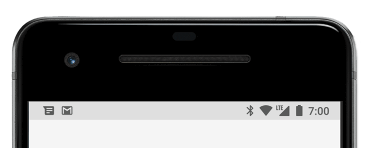

- notification drawer:
	+ Xem chi tiết thông báo và có thể thực hiện action với thông báo.
	+ Có thể kéo xuống để hiển thị chế độ xem mở rộng, hiển thị các nút hành động với notification
	+ Thông báo vẫn hiển thị trong notification drawer cho đến khi người dùng dismiss.

	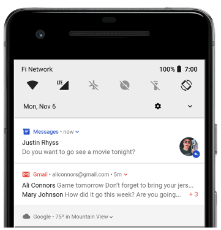

### Heads-up notification
- Từ Android 5.0, Notification có thể xuất hiện nhanh trong một cửa sổ gọi là heads-up notification.
- Notifition loại này thường dành cho các thông báo quan trọng muốn người dùng biết ngay lập tức.
- Chỉ xuất hiện khi device được mở khóa, sẽ mất đi sau một khoảng thời gian, những vẫn hiển thị trong notification drawer

	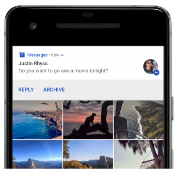

- Trường hợp có thể kích hoạt heads-up notifications:
	+ Hoạt động của người dùng ở chế độ toàn màn hình (fullScreenIntent).
	+ notification có độ ưu tiên cao và sử dụng nhạc chuông hoặc rung (Chạy trên các device từ Android 7.1 trở xuống).
	+ notification channel có độ quan trọng cao với các device từ Android 8.0 trở lên.
### Lock screen
- Từ Android 5.0, notification có thể hiển thị trên màn hình khóa.
- Có thể setup mức độ chi tiết hiển thị của notification, thậm chí có thể có thể quy định notification có hiển thị trên màn hình khóa không
- Người dùng có thể sử dụng system settings để chọn mức độ chi tiết hiển thi, bao gồm cả tùy chọn tắt tất cả thông báo màn hình khóa.
- Bắt đầu từ Android 8.0, người dùng có thể chọn tắt hoặc bật thông báo màn hình khóa cho từng kênh thông báo.

	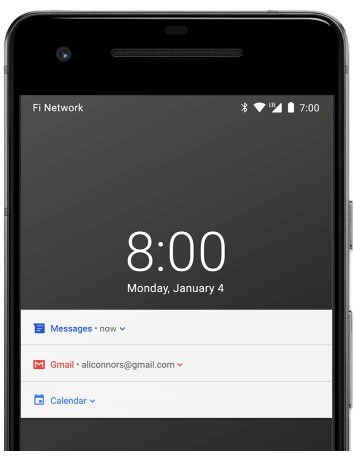

- Tham khảo: https://developer.android.com/training/notify-user/build-notification.html#lockscreenNotification
### App icon badge
- Từ Android 8.0 trở lên, app icon có thể hiển thị thông báo với "badge" (notification dot) được tô màu.
- Người dùng có thể long-press app icon để xem thông báo. Sau đó có thể hủy hoặc tương tác với thông báo đó như notification drawer.

	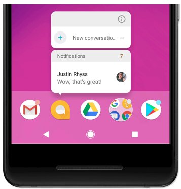

- Tham khảo: https://developer.android.com/training/notify-user/badges.html

## Cấu trúc 1 notification

	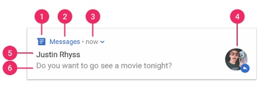
	
- small icon: Bắt buộc và thiết lập bằng setSmallIcon()
- App name: Được cung cấp bởi hệ thống
- Time stamp: Được cung cấp bởi hệ thống nhưng có thể ghi đè bằng setWhen() hoặc ẩn nó bằng setShowWhen(false)
- Larget icon: Đây là tùy chọn (thường sử dụng cho ảnh liên hệ, không sử dụng app icon) và thiết lập bằng setLargeIcon()
- Title: Đây là tùy chọn, thiết lập bằng setContentTitle()
- Text: Đây là tùy chọn, thiết lập bằng setContentText()

### Notification actions
- Không bắt buộc, nhưng mỗi thông báo nên mở một hoạt động thích hợp khi nhấn.
- Ngoài hành động thông báo mặc định, ta có thể thêm action buttons để hoàn thành một nhiệm vụ liên quan từ thông báo (thường là mở một activity)

	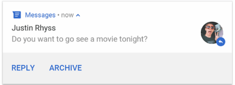

- Bắt đầu từ Android 7.0 (API level 24), ta có thể thêm một hành động để trả lời tin nhắn hoặc nhập văn bản trực tiếp từ thông báo.
### Expandable notification
- Mặc định, nội dung văn bản của notification hiển thị trên 1 dòng, ta có thể mở rộng nội dung bằng cách áp dụng một mẫu bổ sung.

	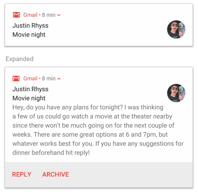

- Cũng có thể tạo thông báo có thể mở rộng bằng hình ảnh, theo kiểu hộp thư đến, cuộc trò chuyên hoặc media playback controls.
- Tham khảo: https://developer.android.com/training/notify-user/expanded.html

## Notification updates and groups
- Để tránh tạo thông báo mới của cùng một loại thông báo, ta nên xem xét cập nhật thông báo đã tồn tại hoặc xem xét sử dụng inbox-style notification để hiển thị cập nhật cuộc hội thoại.
Tham khảo: + https://developer.android.com/training/notify-user/build-notification.html#Updating
	   + https://developer.android.com/training/notify-user/expanded.html#inbox-style
- Nếu cần cung cấp nhiều notification, xem xét nhóm các thông báo riêng biệt đó thành một nhóm (Có sẵn từ Android 7.0 trở lên). Một nhóm thông báo cho phép thu gọn nhiều thông báo chỉ trong một bài đăng trong notification drawer với một bản tóm tắt.

	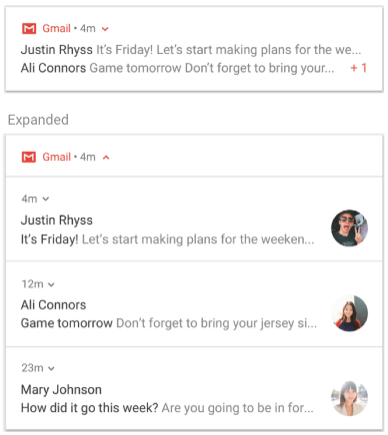

	Note: Nếu cùng một app gửi bốn hoặc nhiều hơn thông báo và không chỉ định một group, hệ thống sẽ tự động nhóm chúng lại vào cùng một groups.
- Tham khảo: https://developer.android.com/training/notify-user/group.html

## Notification channels
- Từ Android 8.0 (API level 26), tất cả các notifications phải assigned vào một channel hoặc nó sẽ không xuất hiện.
- Bằng cách phân loại notification thành các kênh, users có thể vô hiệu hóa các kênh thông báo cụ thể cho ứng dụng (thay vì disable tất cả các thông báo), kiểm soát các tùy chọn về hình ảnh và audio cho mỗi channel. Users cũng có thể long-press một notification để thay đổi hành vi cho kênh liên kết.
Android system settings:

	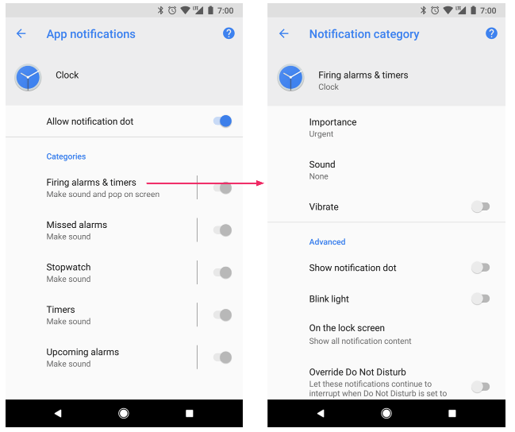

- Các thiết bị chạy Android 7.1 (API level 25) trở xuống, users chỉ có thể quản lý notifications trên mỗi app (Mỗi app chỉ có một channel)
- Một app có thể có nhiều notification channel, có một channel riêng cho mỗi loại notification về sự cố app.
- Một app cũng có thể tạo các kênh thông báo để đáp ứng với các sự lựa chọn của users
Ví du: thiết lập kênh thông báo riêng cho từng nhóm hội thoại.
- Kênh cũng là nơi chỉ định mức độ quan trọng cho thông báo (Android 8.0 trở lên). Vì vậy, tất cả các thông báo cùng một kênh có hành vi giống nhau.
- Tham khảo: https://developer.android.com/training/notify-user/channels.html

## Notification importance
- Android sử dụng ##### importance của thông báo để xác định mức độ thông báo làm ảnh hưởng tới user. Tầm quan trọng của thông báo càng cao, thông báo sẽ càng bị gián đoạn.
- Từ Android 8.0 trở lên, importance của thông báo được xác định bởi ##### importance của channel mà notification được đăng lên.
- Từ Android 7.1 trở xuống, tầm quan trọng của mỗi notification được xác định theo ##### priority của thông báo.

	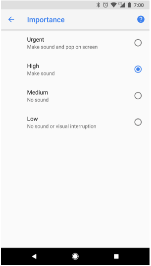

- Các mức ##### importance như là:
	+ Urgent: Có âm thanh thanh và xuất hiện như ##### heads-up notification.
	+ High: Có âm thanh
	+ Medium: Không có âm thanh
	+ Low: Không có âm thanh và không xuất hiện trên status bar.
- Tham khảo: https://developer.android.com/training/notify-user/build-notification.html#Priority

## Do not disturb mode
- Từ Android 5.0, users có thể bật chế độ không làm phiền (Không có âm thanh và rung) cho tất cả các thông báo. Thông báo vẫn xuất hiện ở giao diện người dùng, trừ khi user có chỉ định khác.
- Có 3 mức trong Do not disturb mode:
	+ Total silence: Chặn tất cả các âm thanh và rung như báo thức, âm nhạc, video và game
	+ Alarms only: Chặn tất cả nhạc và rung, ngoại trừ alarms
	+ Priority only: Users có thể cấu hình các danh mục toàn hệ thống có thể làm gián đoạn chúng (chỉ báo thức, nhắc nhở, sự kiện, cuộc gọi, tin nhắn). Đối với tin nhắn và cuộc gọi, user cũng có thể chọn lọc dựa trên người gửi, người gọi.

	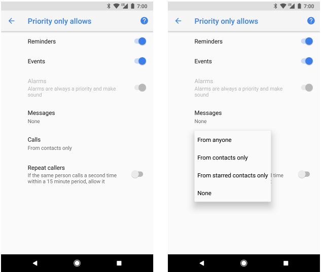

- Từ Android 8.0 trở lên, users có thể cho phép thêm thông báo cho các danh mục (kênh) dành riêng cho ứng dụng bằng cách ghi đè Do Not Disturb trên cơ sở từng kênh.
- Ví dụ: App thanh toán có thể có các kênh thông báo liên quan đến rút tiền và gửi tiền, users có thể cho phép thông báo rút tiền, thông báo gửi tiền, hoặc cả 2 ở chế độ ưu tiên.

## Notification for foreground services
- Một notificaiton được yêu cầu khi app chạy ở "foreground service" ví dụ như media player. Notification này không thể dismiss như các thông báo khác. Để remove notification này, service phải stopped hoặc removed từ trạng thái "foreground"
- Tham khảo:
	+ https://developer.android.com/guide/components/services.html#Foreground
	+ https://developer.android.com/guide/topics/media-apps/audio-app/building-a-mediabrowserservice.html#mediastyle-notifications

## Posting limits
- Bắt đầu từ Android 8.1, app không thể phát âm thanh nhiều hơn 1lần/1s. Nếu app có nhiều thông báo trong 1s, nó sẽ xuất hiện như bình thường nhưng chỉ có thông báo đầu tiên có âm thanh.
- Android giới hạn tốc độ khi cập nhật thông báo, nếu update lên notification quá thường xuyên (nhiều lần chưa đầy 1s) hệ thống có thể bỏ qua một số update.

## Notification compatibility
Một số thay đổi theo phiên bản của Android
-Android 4.1, API level 16
	+ Thêm expandable notification
	+ Thêm các nút hành động vào notification
	+ Thêm chức năng cho user có thể tắt thông báo trên mỗi app trong settings.
- Android 4.4, API level 19,20
	+ Notification listener service đã được thêm vào API
	+ Android Wear hỗ trợ đã được thêm vào API level 20.
- Adnroid 5.0, API level 21
	+ Giới thiệu lock screen và heads-up notifications.
	+ User có thể thiết lập chế độ Do Not Disturb và cấu hình notification nào có thể xuất hiện
	+ Method setVisibility(): cấu hình notification có được hiển thị trên lock screen
	+ Method setPriority(): Chỉ định độ ưu tiên của notification.
- Android 7.0, API level 24
	+ Các mẫu Notification chú ý nhiều đến avatar.
	+ Thêm 3 mẫu notification: 1 cho massage apps, 2 cho trang trí custom content view với khả năng mở rộng.
	+ Hỗ trợ notificaton groups.
	+ Users có thể trả lời trực tiếp từ notification
- Adnroid 8.0, API level 26
	+ Notification phải được đặt vào channel cụ thể
	+ Users có thể tắt thông báo cho từng channel, thay vì phải tắt tất cả các thông báo từ app.
	+ Notification có thể hiển thị ở icon app dưới dạng "badge"
	+ Users có thể xem lại thông báo từ drawer, thiết lập thời gian chờ tự động cho notification.
	+ Có thể thiết lập background color cho notification.
	+ Một số API liên quan đến hành vi của notification được chuyển từ Notification sang NotificationChannel.

# Push notification
- Push notification: 
	+ Là việc gửi thông báo tới thiết bị từ máy chủ ứng dụng mà không có yêu cầu từ người sử dụng.
	+ Push notification không yêu cầu mở ứng dụng để nhận thông báo, vì vậy người dùng có thể thấy thông báo ngay cả khi ứng dụng không mở.
	+ Tương tự như một SMS thông thường nhưng không mất bất cứ khoản tri phí nào.
	+ Đóng một vai trò quan trọng trong thành công của app. Nó giúp ta tiếp cận, tương tác với người dùng, cung cấp cho người dùng các bản cập nhật, cập nhật 
ứng dụng di động và nhiều hơn thế.
	+ Người dùng có thể bật/tắt để nhận thông báo.

	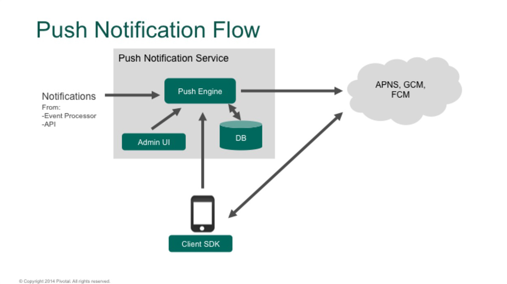

- Cấu trúc: Gồm 3 phần chính
	+ Server: Cung cấp dịch vụ (APNS, FCM, SNS, Pushwoosh,...)
	+ Application server 
	+ Thiết bị cuối: hiển thị thông báo.
- Cơ chế hoạt động:
	+ Các thiết bị client sẽ đăng ký với server để lấy mã token.
	+ Nội dung thông báo sẽ được soạn gửi về server.
	+ Server nhận nội dung thông báo, xử lý rồi gửi về các thiết bị đã đăng ký với server (Đảm bảo có kết nối internet)
- Ưu điểm:
	+ Kích thích sự tham gia của người dùng: Thông báo cho phép bạn giữ liên lạc với người dùng của mình bằng cách cung cấp các tin nhắn kịp thời và các thông tin hữu ích.
	+ Chi phí: Người dùng không phải trả bất cứ phí gì cho thông báo này.
	+ Kiểm soát người dùng: push notification giúp theo dõi hành vi của người dùng, nhận được thông tin chi tiết có giá trị về hành vi của người dùng bao gồm thời gian
tương tác, tỉ lệ nhấp để xem tin nhắn nào có khả năng được mở hơn. Dựa vào đó để chạy các chiến lược tốt hơn tới người dùng.
	+ Nâng cao tính nhất quán thương hiệu: Thông báo cho khách hàng về các giao dịch, phiếu giảm giá và ưu đãi đặc biệt là một cách mạnh mẽ để có thêm một điểm tiếp
xúc trong kênh tiếp thị của ứng dụng. Push notification tạo thành một kênh tiếp thị bổ sung, nơi ta có thể cung cấp thêm thông tin giá trị gia tăng về thương hiệu của mình
	+ Cải thiện chiến lược chăm sóc khách hàng: Nâng cao trải nghiệm của khách hàng, giúp người dùng theo kịp các bản cập nhật, khuyễn mãi và ưu đãi mới nhất, thu hút
sự chú ý của người dùng.

- Nhược điểm:
	+ Notification phụ thuộc vào đường truyền internet, thiết bị, server của nhà cung cấp
	+ Việc lựa chọn thời điểm phát thông báo là rất quan trọng.

### Push notification với FCM (Firebase Cloud Message)
- FCM: Là dịch vụ miễn phí của Google, thông qua FCM các nhà phát triển ứng dụng có thể gửi thông điệp một cách nhanh chóng, an toàn tới các thiết bị cài đặt ứng dụng.
- Ưu điểm:
	+ Thời gian triển khai nhanh, config server dễ dàng
	+ Tiết kiệm chi.
- Message types trong FCM
	+ Notification messages: Được xử lý tự động bởi FCM SDK/ onMessageReceived được gọi khi app ở foreground
	+ Data message: Được xử lý bởi client app/ onMessageReceived được gọi khi app ở cả foreground/background
- Cấu trúc Notification message:

	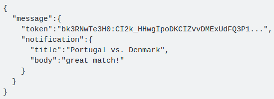

- Xử lý thông báo:
	+ Để nhận notification, tạo 1 service kế thừa FirebaseMessagingService và override 2 method onMessageReceive và onDeleteMessages, Firebase notifications được xử lý khác nhau phụ thuộc vào trạng thái của app (background/foreground)
	+ Foreground: Khi app ở trạng thái foreground, tất cả các tin nhắn nhận được xử lý bởi app. Thực hiện trong method onMessageReceive, hàm này chỉ được gọi khi app ở trạng thái foreground.
	+ Background: Notification sẽ được xử lý theo quy trình Google Service. Thay vì sử dụng notification messages thay bằng data massage

	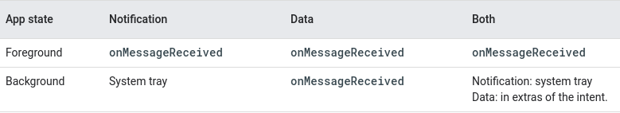

#### Practice:
- Tạo project:
- Đăng ký với Firebase để generate token (Firebase Console)
	+ Tạo project/ import project vào Firebase
	+ Sau khi tạo xong vào mục setting để tạo application mà firebase sẽ làm việc

		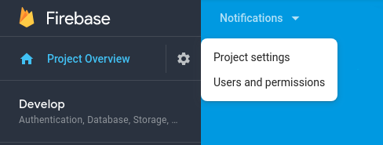

	+ Ở phần Your chọn nền tảng sử dụng. Ví dụ ở đây mình đang làm việc với Android. Hoàn thành các mục

		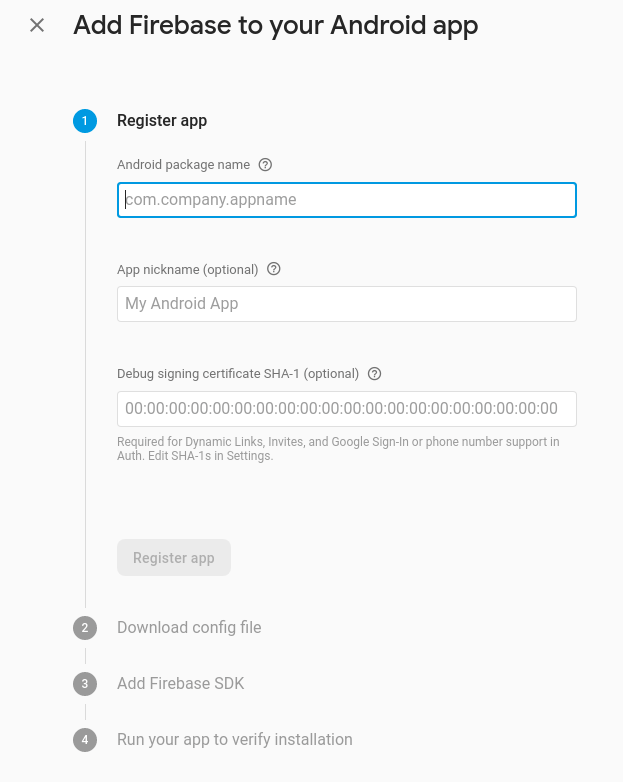

	+ Download google-services.json và thêm vào trong app. FCM sẽ sử dụng file này để xác thực ứng đã đăng ký và tạo token cho client 

		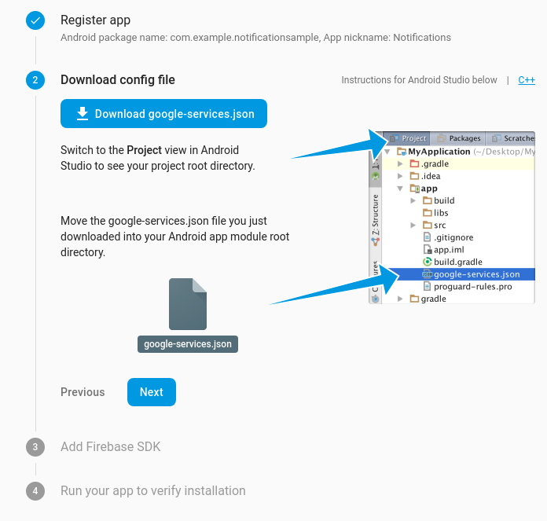

	+ Thêm Firebase SDK

		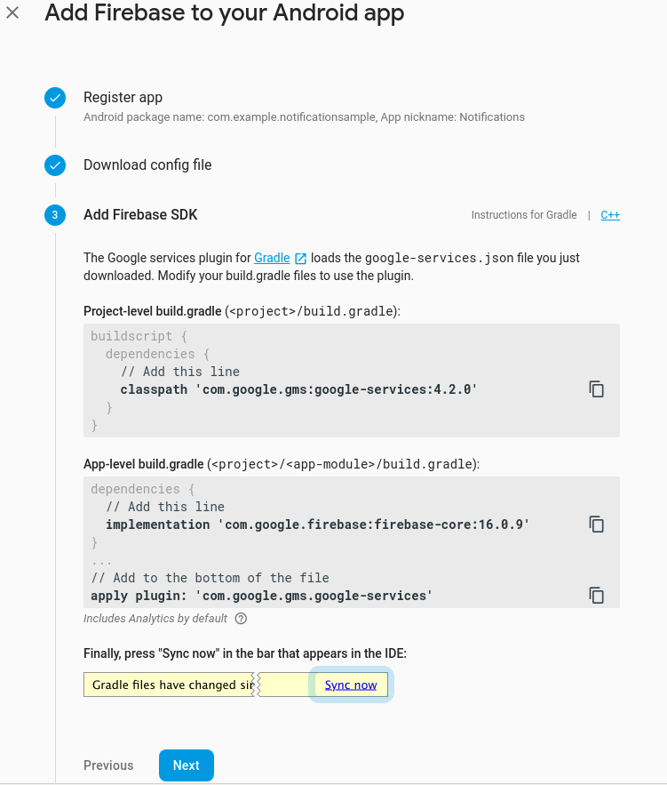

	+ Run your app to verify installation
- Generate token và nhân thông báo
	+ Tạo class InstanceIdService kế thừa từ FirebaseMessagingService

		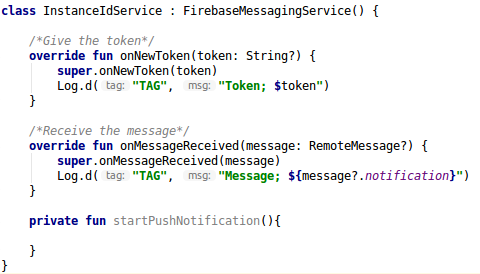

- Tham khảo:
	+ https://developer.android.com/guide/topics/ui/notifiers/notifications#appearances
	+ https://firebase.google.com/docs/cloud-messaging/android/receive
	+ https://medium.com/@nileshsingh/how-to-add-push-notification-capability-to-your-android-app-a3cac745e56e
	+ https://medium.com/techsuzu/android-push-notification-using-fcm-firebase-cloud-messaging-c37d165b8320
	+ https://medium.com/@cdmunoz/working-easily-with-fcm-push-notifications-in-android-e1804c80f74
- Đọc thêm:
	+ https://medium.com/@deividi/a-good-way-to-handle-incoming-notifications-in-android-dc64c29041a5
	+ https://android.jlelse.eu/android-push-notification-using-firebase-and-advanced-rest-client-3858daff2f50

